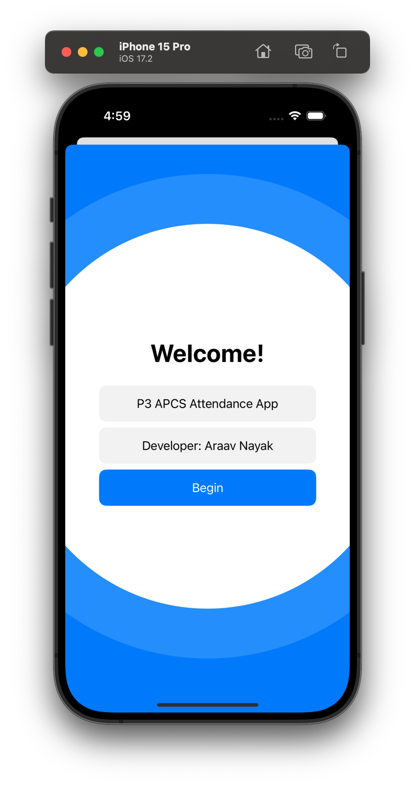
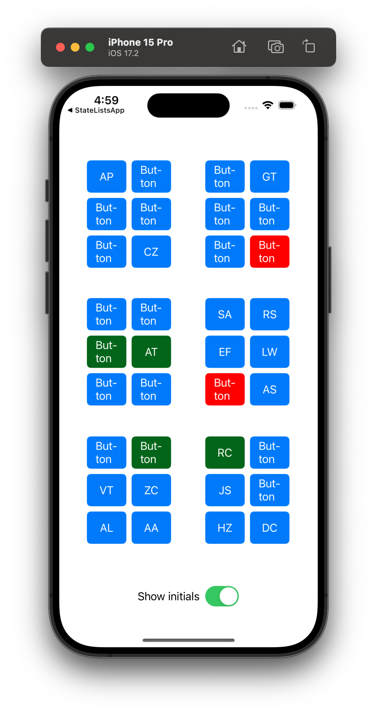
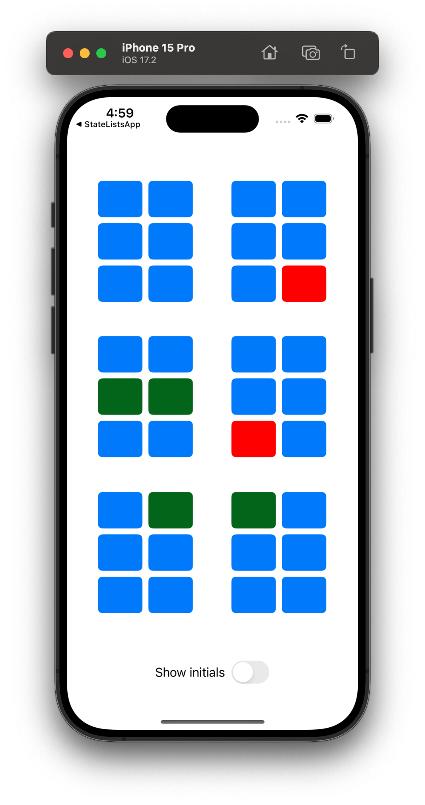

# P3-APCS-Attendance-App

Simple iOS app to make taking attendance more easier especially when students may not be sitting in their assigned seat. This app allows the user to click on each seat represented by a button, which toggles between marked present (green) and absent (red). There is also a switch at the bottom that can be toggled between displaying students' initials and not displaying them. Furthermore, this app leverages the native CoreData framework and NSFetchedResultsControllerDelegate to seed the roster for each class on a persistent container on the device storage. After toggling the settings icon on, clicking on any seat allows the user to edit the name stored under that position and saves these changes.

<table>
  <tr>
    <td></td>
    <td></td>
  </tr>
  <tr>
    <td></td>
  </tr>
</table>

